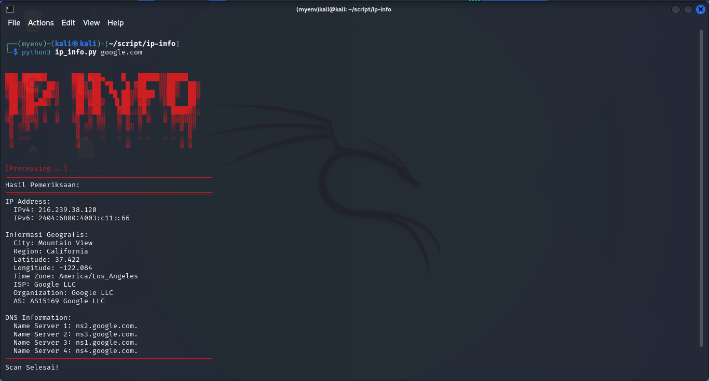

# IP Info

**IP Info** adalah tools yang digunakan untuk memeriksa informasi terkait domain seperti alamat IP (IPv4 dan IPv6), informasi geografis berdasarkan IP, dan informasi DNS (Name Server).

## Cara Cek Versi Python pada Setiap OS

### Windows
1. Buka Command Prompt (`cmd`).
2. Jalankan perintah berikut untuk memeriksa versi Python:
   ```bash
   python --version
   ```
   atau
   ```bash
   python3 --version
   ```

### Linux/macOS
1. Buka Terminal.
2. Jalankan perintah berikut untuk memeriksa versi Python:
   ```bash
   python3 --version
   ```

## Install Liblary Yang Di Butuhkan

### Windows
   ```bash
   pip install requests dnspython colorama
   ```

### Linux/macOS
   ```bash
   pip3 install requests dnspython colorama
   ```

## Cara Penggunaan

1. Clone repository ini ke sistem lokal Anda:
   ```bash
   git clone https://github.com/SyhrlmyZID/ip-info.git
   ```

2. Jalankan script ini menggunakan perintah berikut:
   ```bash
   python3 ip_info.py <domain>
   ```
   Gantilah `<domain>` dengan nama domain target, misalnya:
   ```bash
   python3 ip_info.py google.com
   ```

## Screenshot


